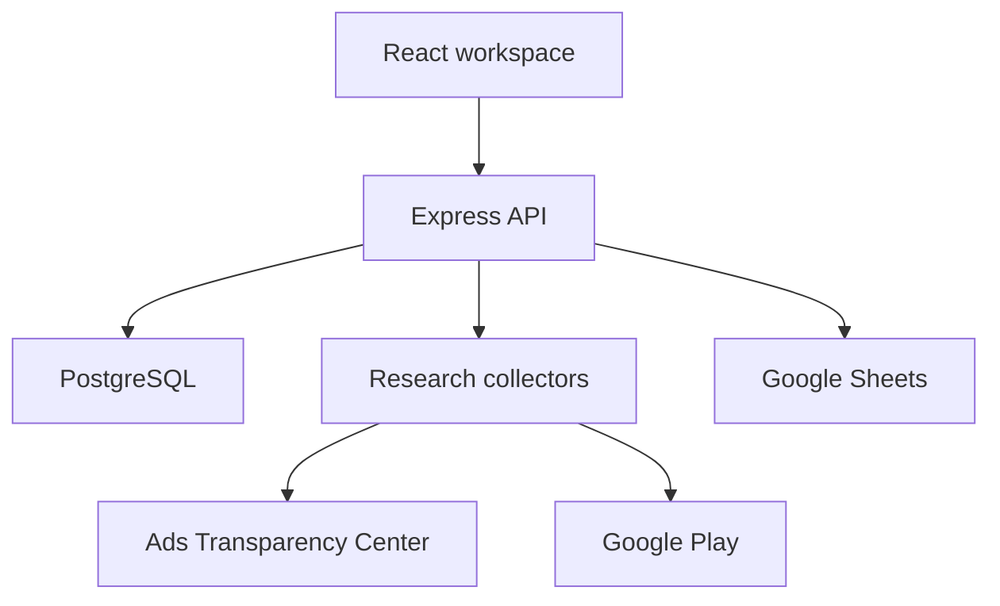

# Atlas
**Competitive intelligence and research tooling for mobile games.**

Built by [Danish Asif](https://github.com/ProfessionalPea).

Atlas brings competitor discovery, Google Play metadata, ad creative research and country availability checks into one workspace. It grew out of the practical research needs of mobile game publishing and ASO.

## The problem
Research often means moving between Google Ads Transparency Center, Google Play and spreadsheets. Atlas connects those steps so discovered publishers, games and creatives can be explored together and revisited later.

## What it does
- Scans Google Ads Transparency Center to discover advertised games and publishers.
- Collects Google Play listing information and presents a searchable directory.
- Tracks ad creatives and scan history for competitive research.
- Checks a package's country availability, including live, pre-registration, early access, unavailable and unknown classifications.
- Stores country scan results by package name, including packages not previously discovered by an ad scan.
- Collects available ad video references and metadata into a video library.
- Extracts keyword signals from game listing text.
- Tracks suspended games and preserves research snapshots.
- Supports target lists, saved competitors and Google Sheets synchronization.
- Provides authenticated access with full-access and view-only roles.

**Email reporting has been retired.** The remaining reporting module is a compatibility layer; email reporting is not an active feature.

## Stack
| Layer | Technologies |
| --- | --- |
| Interface | React, Vite, Tailwind CSS, Framer Motion, Recharts |
| API | Node.js, Express |
| Database | PostgreSQL via `pg` |
| Collection | Playwright/Chromium, google-play-scraper |
| Integrations | Google Sheets API and service-account credentials |

## Architecture


The API coordinates scans and persists research data. The frontend polls for scan progress. Country scan results survive a page reload; a server restart can interrupt an active scan, which is recorded as an error rather than automatically resumed.

## Repository guide
| Path | Purpose |
| --- | --- |
| `backend/server.js` | API, authentication, scan orchestration and database operations |
| `backend/GoogleAdsScanner.js` | Scanner entry point and creative accounting |
| `backend/GoogleAdsScannerV3.js` | Current ad scanner implementation |
| `backend/CountryAvailabilityScanner.js` | Package-level country checks |
| `backend/AtlasExtensions.js` | Registers additive intelligence routes and storage |
| `backend/IntelligenceFeatures.js` | Video collection relationships and keyword routes |
| `backend/KeywordAnalyzer.js` | Listing-text keyword analysis |
| `backend/GoogleSheetsSync.js` | Spreadsheet integration |
| `frontend/src/App.jsx` | Main application interface |

Earlier scanner versions remain in the repository; the entry point currently uses V3.

## Local setup
### 1. Prerequisites
- A recent Node.js version compatible with the installed Vite version.
- npm.
- A PostgreSQL database with the existing Atlas base schema.
- Chromium installed through Playwright.

**Database setup limitation:** this repository does not currently include a complete initial schema or migration runner. Startup creates some feature tables and applies additive changes, but expects core tables such as `competitors`, `accounts`, `games`, `account_games` and `settings` to exist. An empty database is not sufficient. Obtain a schema-only export from an existing installation before following the remaining steps.

### 2. Clone and install
```bash
git clone https://github.com/ProfessionalPea/atlas.git
cd atlas/backend
npm ci
npx playwright install chromium
```

On Linux, Playwright may also need system dependencies:
```bash
npx playwright install --with-deps chromium
```

### 3. Configure the API
Copy `backend/.env.example` to `backend/.env` and supply your database URL and a strong session secret. Run commands from `backend` so dotenv loads the expected file.

For optional Sheets synchronization, set `GOOGLE_CREDENTIALS_JSON` or use an untracked `backend/google-credentials.json` file. Share the target spreadsheet with the service-account email and configure `google_sheet_id` in Atlas settings.

### 4. Start the API
```bash
npm run dev
```
The default API address is `http://localhost:3000`; `/api/health` is the health endpoint.

### 5. Start the interface in another terminal
```bash
cd atlas/frontend
npm ci
npm run dev
```
Open the address printed by Vite. On localhost, the current frontend uses port 3000 for the API. For a hosted frontend, set `VITE_API_BASE_URL` and configure `FRONTEND_URL` on the backend; see `frontend/.env.example`.

### 6. Build the interface
```bash
npm run build
```

## Accuracy and deployment considerations
- Country classifications are observations from public store responses, not authoritative Play Console release records. Unknown results should be reviewed.
- Keyword signals come from listing text; they are not measured search volume or guaranteed ranking opportunities.
- Some ads expose no usable video reference. Direct media URLs may expire.
- External page changes, throttling and network failures can affect collection.
- Current authentication seeds fixed default accounts, has a fallback session secret, and uses SHA-256 password hashing. Replace these defaults and upgrade password storage before a public deployment.
- The backend currently disables TLS certificate verification. Restore certificate validation before a public deployment.
- Sheets synchronization still has a hardcoded fallback spreadsheet ID; configure your own target.

## Demo and screenshots
No public demo or sanitized dashboard screenshots are included yet. Before sharing the project broadly, add a dashboard image, country scan result and video library example under `docs/screenshots/`, using demonstration data.

## Author
[Danish Asif](https://github.com/ProfessionalPea) — building tools around mobile game research, automation and operational workflows.

## License
No project license is currently declared in this repository.
